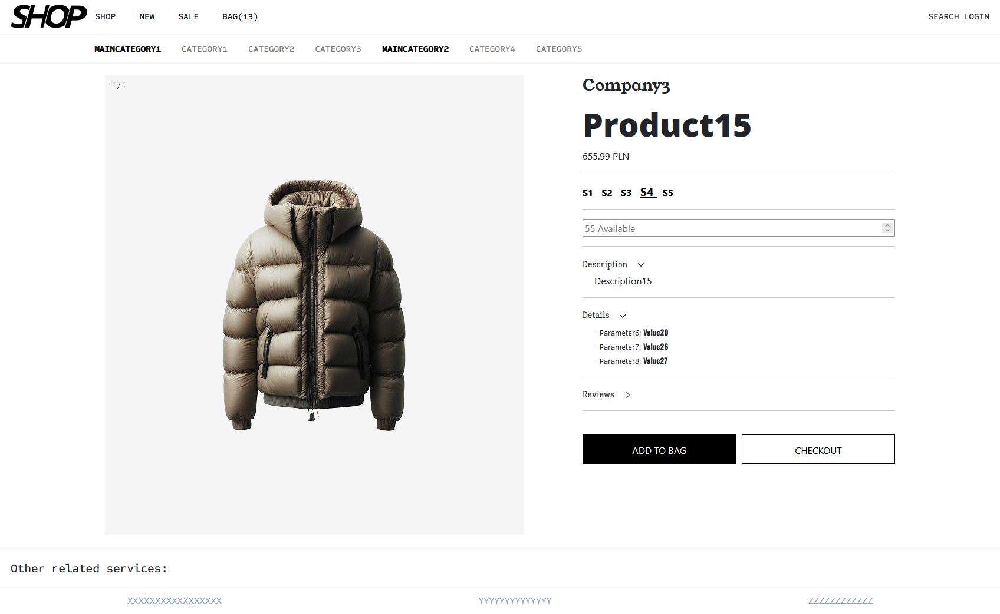
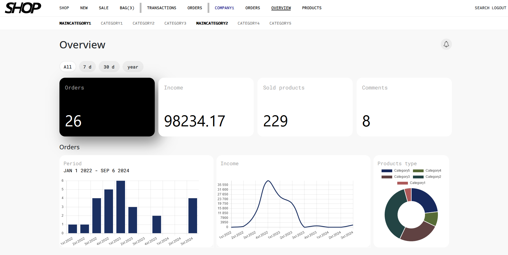
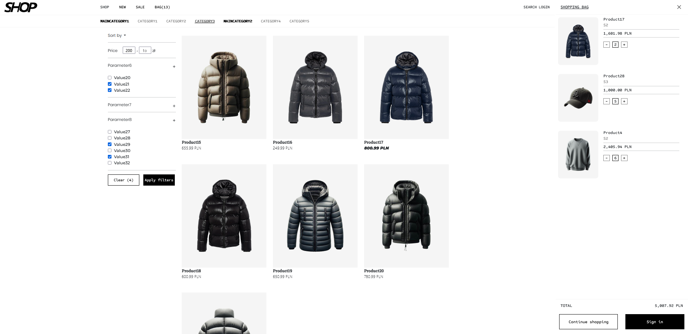
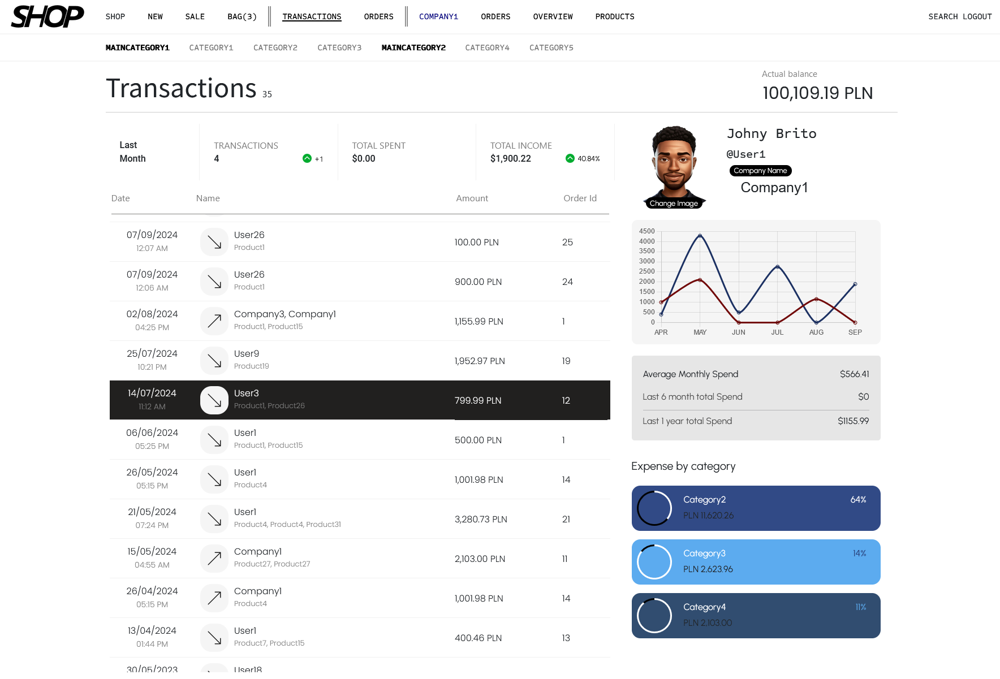
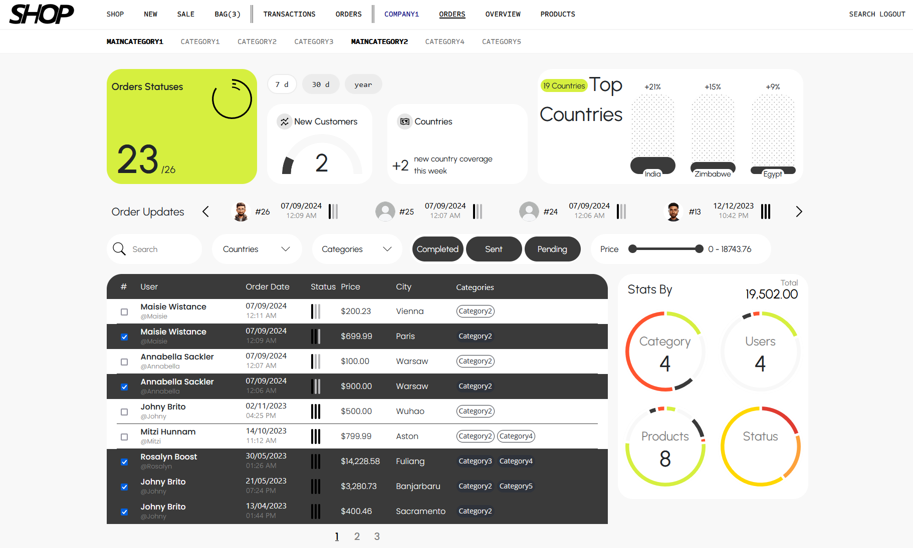
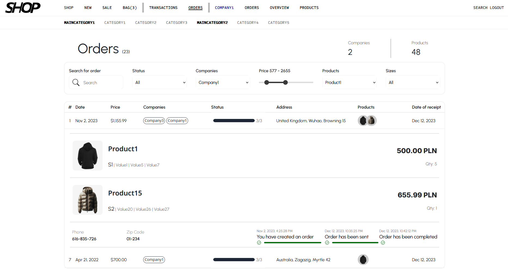

# Several Page Views

An online store application that allows users to add and manage products through an administration panel. The app also allows users to register, log in, place orders, track order status, and view/manage statistics.

Stack: Angular, Spring Boot, Spring Security, Spring Data JPA, Hibernate, PostgreSQL, Redis, AWS S3, Liquibase, Docker

